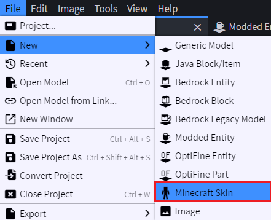
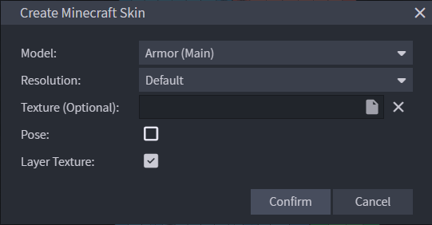
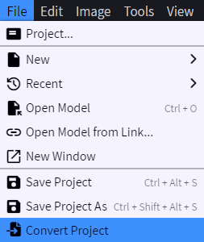
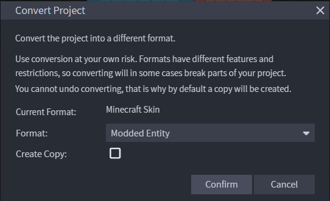
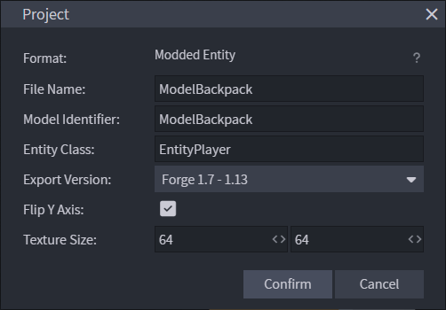

# 1.12.2 - How to create custom ModelBiped for wearable item

**This guide will focus on using Blockbench for create and export model**

## Create template model

**You can skip if you already have one or you don't need the template**

1. Create new model as **Minecraft Skin**.

  - `Create Minecraft Skin` dialog will show up. Config like below. 
        <table>
          <thead><tr>
            <th>Model</th><th>Resolution</th><th>Pose</th>
          </tr></thead>
          <tbody><tr>
            <td>Armor (Main)</td><td>Your choice</td><td>Untick</td>
          </tr></tbody>
        </table>


2. New tab should show up. Now lets convert this project to `Modded Entity` (`File` -> `Convert Project`)  


- You can choose to create new copy if you have any usage. Now save it up so we can later use it as template.

## Convert exist model
If you already have model, import it to Blockbench, then convert it using step 2 from `Create template model`

## Config project
Make sure to properly config it correct, or you may have headache try to debug things out.


## Export model
After you complete the model, next step would be to export out so we can import it to our Java project.
Select `File` -> `Export` -> `Export Java Entity`. Save the Java class file to where you want.

Open the Java file, it should be like this:
```java
// Made with Blockbench <version>
// Exported for Minecraft version 1.7 - 1.12
// Paste this class into your mod and generate all required imports


public class ModelBackpack extends ModelBase {
    // bone model render instance

    public ModelBackpack() {
        // model construction...
    }

    @Override
    public void render(Entity entity, float f, float f1, float f2, float f3, float f4, float f5) {
        // render code...
    }

    public void setRotationAngle(ModelRenderer modelRenderer, float x, float y, float z) {
        modelRenderer.rotateAngleX = x;
        modelRenderer.rotateAngleY = y;
        modelRenderer.rotateAngleZ = z;
    }
}
```

Change `ModelBase` to `ModelBiped`, then add your `package` path and import all missing imports.

To use this class, make sure your Item is inherited from `ItemArmor` class. Then override `ModelBiped getArmorModel(EntityLivingBase entityLiving, ItemStack itemStack, EntityEquipmentSlot armorSlot, ModelBiped _default)` like below:
```java
    @SideOnly(Side.CLIENT)
    @Nullable
    public ModelBiped getArmorModel(EntityLivingBase entityLiving, ItemStack itemStack, EntityEquipmentSlot armorSlot, ModelBiped _default)
    {
        return new YourModelClass();
    }
```